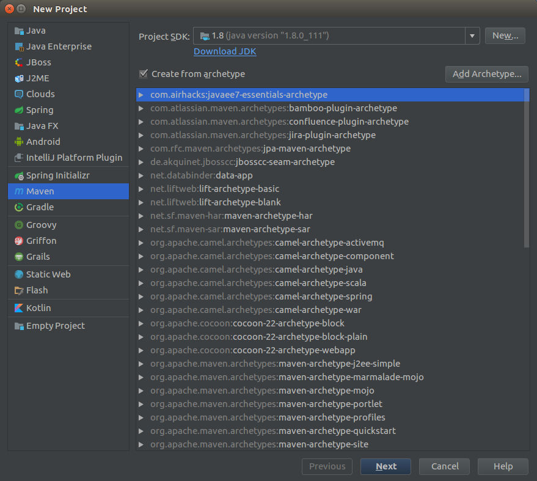
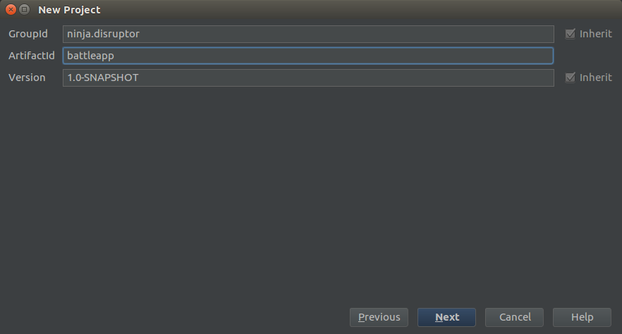
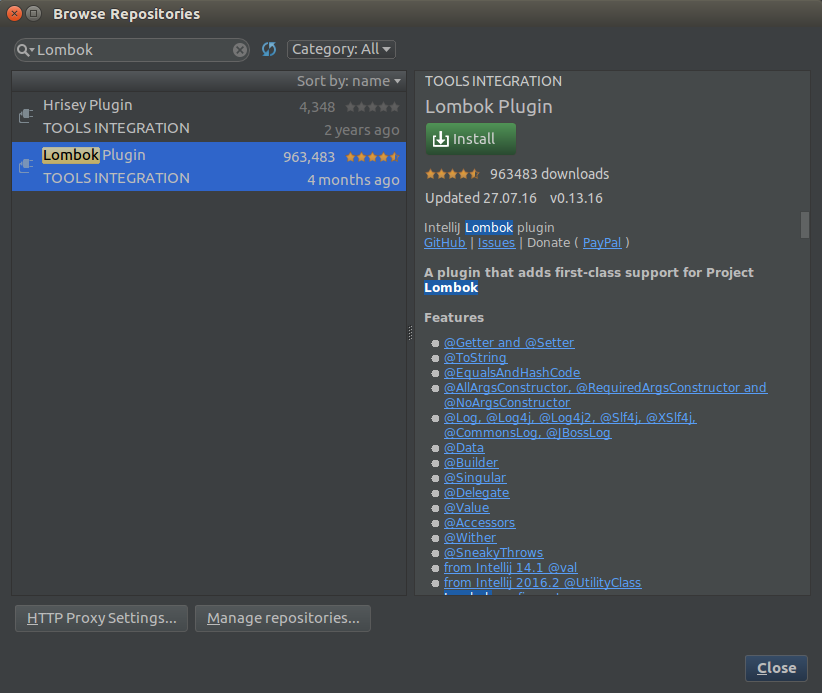
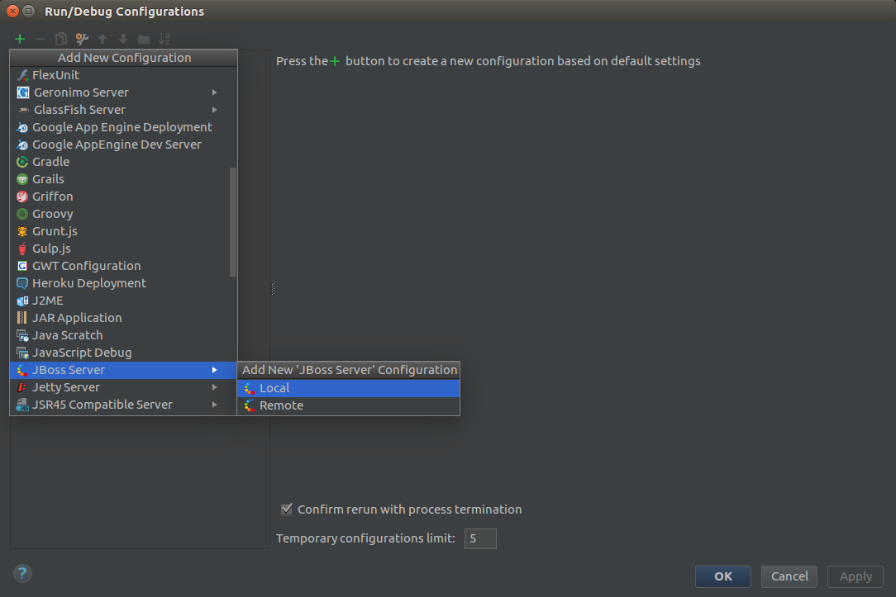
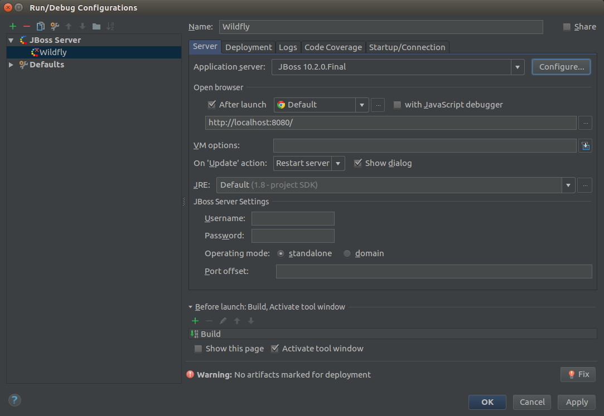
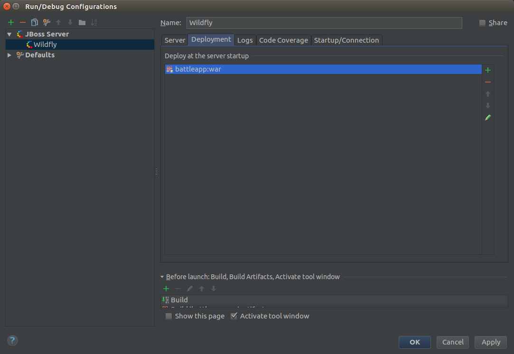

# Creating our first JavaEE microservice
Our first microservice is a REST service written in Java. I'm using JavaEE and Wildfly
as application server. JavaEE is the perfect combination with Docker.  
Wildfly can be downloaded from [here](http://wildfly.org/downloads/).  
As IDE I'm using IntelliJ.
> IntelliJ and Maven is already installed during the [host setup](../01_Setup/Host_setup.md).

## Setup a new maven project
I'm using a minimalistic maven setup:  
```
com.airhacks:javaee7-essentials-archetype:1.3
```

To create a project in IntelliJ with this Archetype you have to open IntelliJ and choose 
`File -> New -> Project...`  
And make the following settings:  


If you creating a project with this Archetype for the first time you have to use `Add Archetype...`
and insert the information from the Archetype.

Now click `Next` and insert the project settings:  


Click `Next` `Next` `Finish`

Now you can implement the REST service. I've made a simple service that can be cloned from  
[here](https://github.com/robertBrem/battleapp).

## Using Lombok
I use Lombok in my example service. To use Lombok you have to add the dependency to the 
`pom.xml` as well as to install the Lombok plugin in IntelliJ. You can install the plugin
over `File -> Settings...` `Plugins` `Browse repositories...` and search for *Lombok*.  


Click `Install` `Restart`.

Add this to you `pom.xml`:
```
<dependency>
    <groupId>org.projectlombok</groupId>
    <artifactId>lombok</artifactId>
    <version>1.16.12</version>
</dependency>
```

This is also available as IntelliJ live template.

Now you can use Lombok for constructors, getters, setters, toString and so on. This
is useful especially for data classes:
```java
@AllArgsConstructor
@Data
public class User {
    private String name;
}
```

## Using porcupine for thread pools
To have a fully async REST service we've to use thread pools as bulkheads and to handle
backpressure.

Therefore we use porcupine.
```
<dependency>
    <groupId>com.airhacks</groupId>
    <artifactId>porcupine</artifactId>
    <version>0.0.4</version>
</dependency>
```

Here is the implementation of our `jax-rs` service.

```java
@Path("users")
@Produces(MediaType.APPLICATION_JSON)
public class UserResource {

    @Dedicated
    @Inject
    ExecutorService usersPool;

    @Inject
    UserService userService;

    @GET
    public void getUsers(@Suspended AsyncResponse response) {
        CompletableFuture
                .supplyAsync(userService::getUsersAsGenericEntity, usersPool)
                .thenAccept(response::resume);
    }

}
```

It is also possible to configure the thread pool in code:
```java
@Specializes
public class CustomExecutorConfigurator extends ExecutorConfigurator {

    @Override
    public ExecutorConfiguration defaultConfigurator() {
        return super.defaultConfigurator();
    }

    @Override
    public ExecutorConfiguration forPipeline(String name) {
        if ("heavy".equals(name)) {
            return new ExecutorConfiguration.Builder().
                    corePoolSize(4).
                    maxPoolSize(8).
                    queueCapacity(16).
                    keepAliveTime(1).
                    callerRunsPolicy().
                    build();
        }
        return super.forPipeline(name);
    }

}
```

## Export entities as JSON
`Set`s and `List`s can't be automatically exported as JSON arrays there fore we need
the `GenericEntity` like in our control. 
``` 
@Stateless
public class UserService {
 
    public GenericEntity<Set<User>> getUsersAsGenericEntity() {
        return new GenericEntity<Set<User>>(getUsers()) {
        };
    }
 
    public Set<User> getUsers() {
        HashSet<User> users = new HashSet<>();
        users.add(new User("Rob"));
        users.add(new User("Dan"));
        users.add(new User("Kevin"));
        users.add(new User("Corine"));
        return users;
    }
 
}
```

## Wildfly in IntelliJ
You can setup Wildfly in IntelliJ over the `Edit Configuration...` menu.  


Click on the `+`  


In the `Server` tab make the following settings:  


Change to the `Deployment` tab and add the artifact:  


## Test the service
To test the service you simply have to push the play button:  


And call the following url: `http://localhost:8080/battleapp/resources/users`.
The output should be something like that:
```bash
[{"name":"dan"},{"name":"robert"},{"name":"kevin"}]
```
