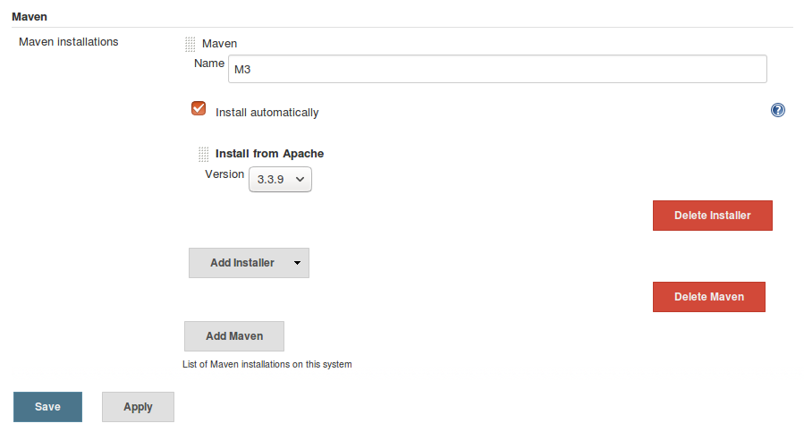
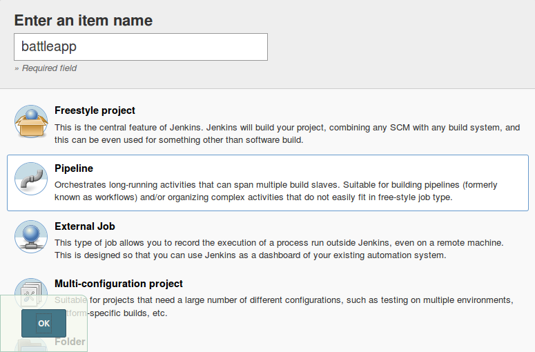
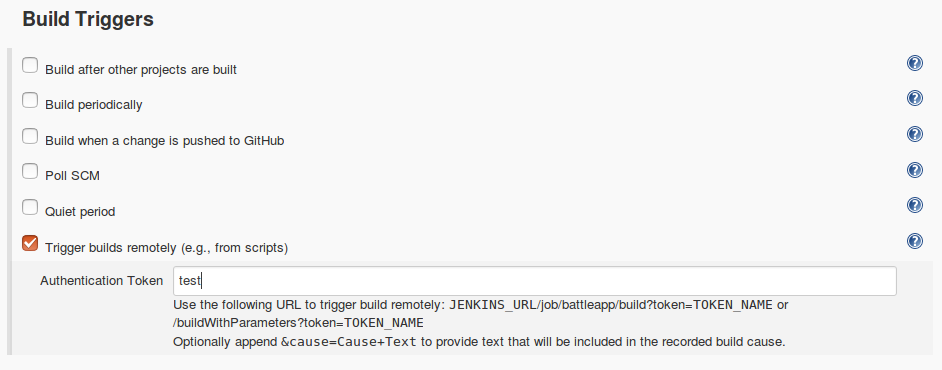
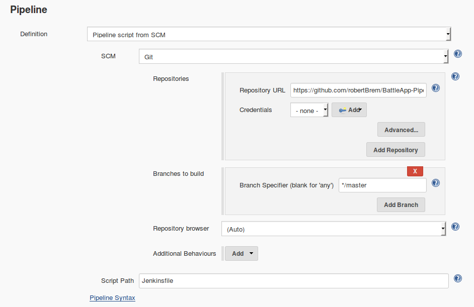

# Build and push CI step
The first step of the CI/CD pipeline is the creation of the service as a Docker image.  

# Create a `Jenkinsfile`
To create a new pipeline we've to create a `Jenkinsfile` similar to [this one](https://gist.github.com/robertBrem/b18dee521176a3d75026cbe902d16b2f).
```groovy
withEnv(["VERSION=1.0.${currentBuild.number}", "REGISTRY_EMAIL=brem_robert@hotmail.com"]) {
  stage "checkout, build, test and publish"
  node {
    git url: "https://github.com/robertBrem/battleapp"
    def mvnHome = tool 'M3'
    sh "${mvnHome}/bin/mvn clean install"
    sh "./build.js"
  }
}
```

## Install Maven in Jenkins
Before we can execute this pipeline we have to install Maven in Jenkins.  
`Manage Jenkins` `Global Tool Configuration` `Add Maven`  
There we set the name to `M3`  
  

## Create the build script
The script to build and push the Docker image is written in JavaScript and gets executed
with Nashorn.
```
#!/usr/bin/jjs -fv

var version = $ENV.VERSION;
var username = $ENV.REGISTRY_USERNAME;
var password = $ENV.REGISTRY_PASSWORD;
var email = $ENV.REGISTRY_EMAIL;

var registry = "disruptor.ninja:30500";
var image = "robertbrem/battleapp";
var completeImageName = registry + "/" + image + ":" + version;

var dockerBuild = "docker build -t " + completeImageName + " .";
execute(dockerBuild);

var dockerLogin = "docker login --username=" + username + " --password=" + password + " --email=" + email + " " + registry;
execute(dockerLogin);

var push = "docker push " + completeImageName;
execute(push);

function execute(command) {
    $EXEC(command);
    print($OUT);
    print($ERR);
}
```
This script is available as live script.

That the script can be executed it has to be executable:
```
chmod 750 build.js
```

## Create the pipeline in Jenkins
Now create the Jenkins pipeline with the created `Jenkinsfile`.  
Click in Jenkins on `New item` with the name `battleapp` and of type `Pipeline`.  
  

Choose `Trigger builds remotely (e.g., from scripts)` and set a token.  
  

Choose `Pipeline script from SCM` with the following settings:  
  

Then `Save` and `Build Now`.  
