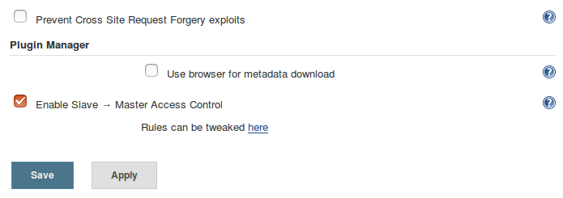
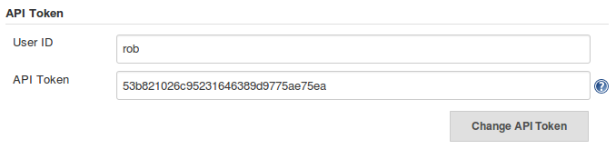
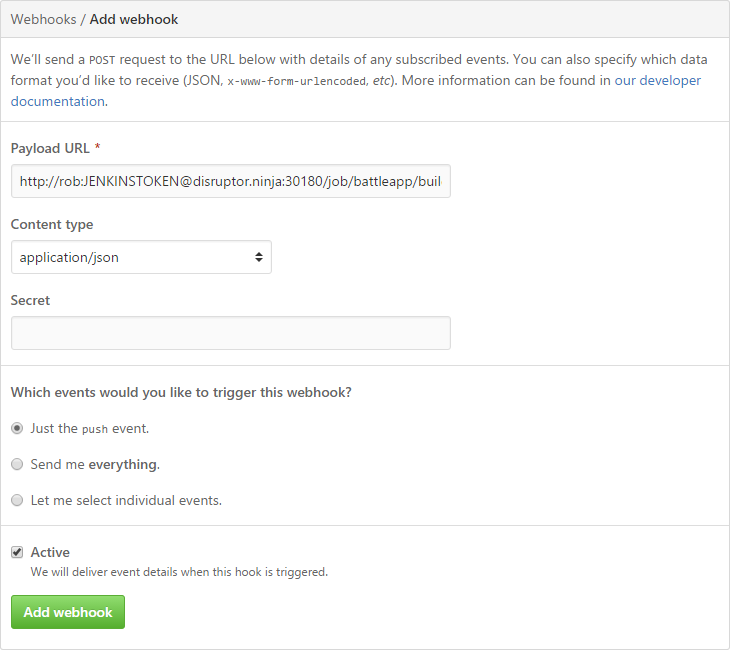

# Start the Jenkins pipeline on every push
During the creation of the Jenkins pipeline we've created a token that we can start the
pipeline automatically. Now we're going to use this hook.

## Deactivate CSRF
If [CSRF](https://en.wikipedia.org/wiki/Cross-site_request_forgery) is activated we've 
to create a crumb that have to be transmitted with the token as well. In this example 
I'm simply deactivating CSRF in Jenkins.

In Jenkins select `Manage Jenkins` `Configure Global Security` and deselect
`Prevent Cross Site Request Forgery exploits` and `Save`.  


## Create hook in GitHub
> If we are using an own Git repository like GoGs this is working exactly the same!

To create a webhook in GitHub we first need the Jenkins API token. You can find the 
Jenkins token in Jenkins under `People` `rob` (username) `Configure`
`Show API Token`  


On the project in GitHub go to `Settings` `Webhooks` `Add Webhook` and enter the 
payload url like this:
```
http://rob:[JENKINS:TOKEN]@disruptor.ninja:30180/job/battleapp/build?token=test
```


Finally click on `Add webhook`.

Now every push on this GitHub repository starts the Jenkins pipeline.