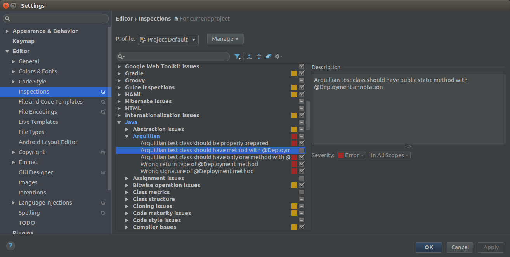
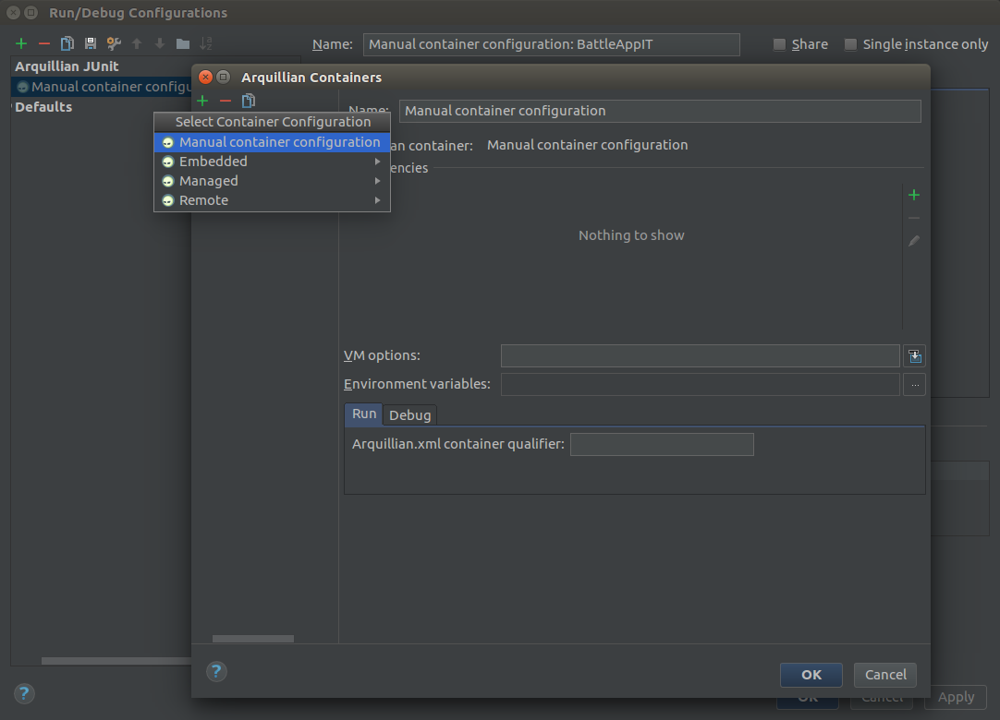
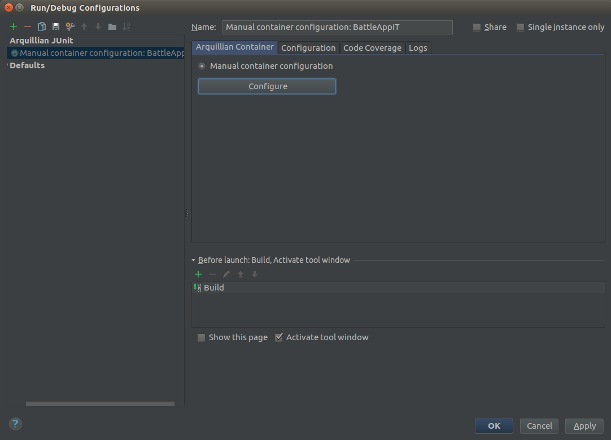

# UI Test
Create a UI test similar to [this one](https://github.com/robertBrem/BattleApp-UIT).

Therefore we need the following dependencies:
```
<dependency>
    <groupId>org.jboss.arquillian.junit</groupId>
    <artifactId>arquillian-junit-container</artifactId>
    <scope>test</scope>
</dependency>
<dependency>
    <groupId>org.jboss.arquillian.graphene</groupId>
    <artifactId>arquillian-graphene</artifactId>
    <type>pom</type>
    <version>2.1.0.Alpha3</version>
    <scope>test</scope>
</dependency>
<dependency>
    <groupId>junit</groupId>
    <artifactId>junit</artifactId>
    <version>4.12</version>
    <scope>test</scope>
</dependency>
```

And the following test classes:

```
@Location("http://disruptor.ninja:31080/battleapp/resources/users")
public class BattleAppPage {
}
```
```
@RunAsClient
@RunWith(Arquillian.class)
public class BattleAppIT {

    @Drone
    WebDriver browser;

    @Test
    public void shouldContainRobert(@InitialPage BattleAppPage page) {
        String expectedToContain = "Rob";
        String content = browser.getPageSource();
        assertThat(content, containsString(expectedToContain));
    }

}
```

IntelliJ thinks every Arquillian class needs a `@Deployment` method. That's
not true. Therefore we've to disable this setting.  
`File -> Settings...` `Editor -> Inspections` 



When you try to run the test IntelliJ expects an Arquillian configuration.
We create an empty `Manual container configuration`.



And select this configuration for our test.



Include the test in the Jenkins pipeline:
```
  stage "ui test"
  node {
    git url: "https://github.com/robertBrem/BattleApp-UIT"
    def mvnHome = tool 'M3'
    sh "${mvnHome}/bin/mvn clean install failsafe:integration-test failsafe:verify"
    step([$class: 'JUnitResultArchiver', testResults: '**/target/failsafe-reports/TEST-*.xml'])
  }
```

Then `Build Now`.