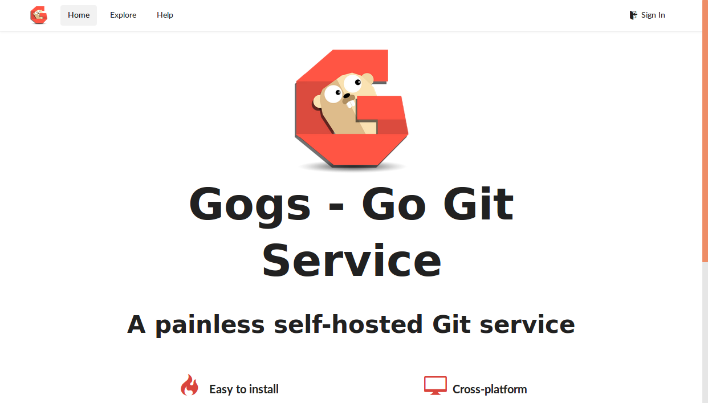

# Use your own Git repository
I prefer complex systems over complicated systems therefore I create a lot of repositories.
If you don't want to spam your GitHub account you can easily create an own 
[GoGs repository](https://gogs.io/).

## Create folders for the persistence
The GoGs repository has persistent data therefore we've to mount this data somewhere.
The easiest way to do that is over a node selector. A more advanced solution would be
to use GlusterFS, Flocker, NFS or something similar.

If we use node selectors for our persistence then we've to log in to the server
we want to persist the GoGs data.

```
ssh root@5.189.154.24
```
On the server we've to create the folder structure that gets mounted to the host.
```
mkdir -p gogs/data
```

## Kubernetes deployment
To tell Kubernetes to schedule the GoGs repository pod on specified node we've to 
label the node:
```
kc label nodes vmi71992.contabo.host name=vmi71992
```
Next we create a `deployment.yml` file [like this one](https://gist.github.com/robertBrem/31b7ad46c8ee531c8dcd575989454825).
```
apiVersion: extensions/v1beta1
kind: Deployment
metadata:
  name: gogs
spec:
  replicas: 1
  template:
    metadata:
      labels:
        name: gogs
    spec:
      containers:
      - resources:
        name: gogs
        image: gogs/gogs:0.9.97
        ports:
        - name: gogs-port
          containerPort: 3000
        volumeMounts:
        - mountPath: /data
          name: data
      volumes:
      - name: data
        hostPath:
          path: /root/gogs/data
      nodeSelector:
        name: vmi71992
```
This file has to be deployed:
```
kc create -f deployment.yml
```
To test if the deployment is working you can display all pods:
```
kc get po
```
```
NAME                      READY     STATUS    RESTARTS   AGE
registry-95525520-9rdvc   1/1       Running   0          1m
```

## Kubernetes service
To make the repository visible outside the cluster we have to create a Kubernetes service.
The `service.yml` file can be created similar to [this file](https://gist.github.com/robertBrem/68706f161388b7307bb0).
```
apiVersion: v1
kind: Service
metadata:
  name: gogs
  labels:
    name: gogs
spec:
  ports:
  - port: 3001
    targetPort: 3000
    nodePort: 30130
  selector:
    name: gogs
  type: NodePort
```
To test the repository we can call the following url:
```
http://disruptor.ninja:30130
```

## Disable register
After you have created your own user you better should disable the register
button. Otherwise everybody from the internet can create new users and repositories.
To disable registration you have to connect to into your Kubernetes pod.
To find the correct pod use this command:
```
kc get po | grep gogs
```
```
gogs-2819519451-kmpgj                       1/1       Running   0          1h
```

Now connect into the container inside this pod:
```
kc exec -it gogs-2819519451-kmpgj bash
```

And open the following file:
```
vi /data/gogs/conf/app.ini
```

Search for `DISABLE_REGISTRATION` set it to `true` and add 
`SHOW_REGISTRATION_BUTTON`:
```
DISABLE_REGISTRATION   = true
SHOW_REGISTRATION_BUTTON = false
```

Now kill the running pod. Kubernetes will reschedule the GoGs and start it with
the new settings:
```
kc delete pod gogs-2819519451-kmpgj
```

After the restart there is no more register button on the upper right next to
`Sign In`.

