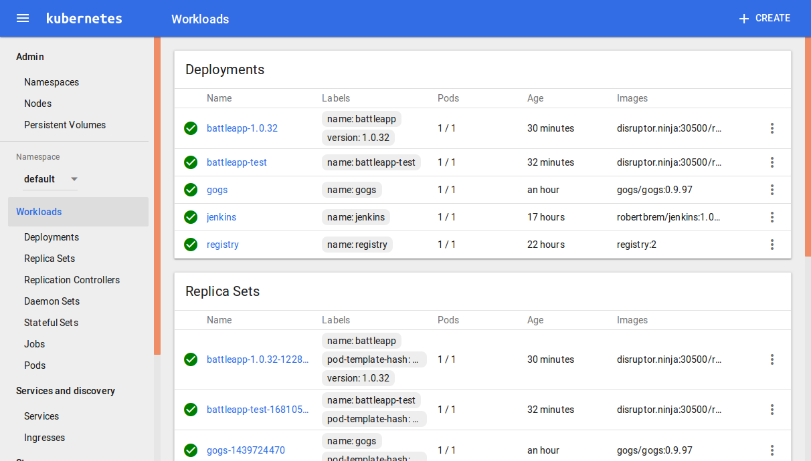

# Kubernetes dashboard
To add a dashboard to your cluster we simple have to execute this command:
```
kc create -f https://rawgit.com/kubernetes/dashboard/master/src/deploy/kubernetes-dashboard.yaml
```

To access the dashboard we've to find out the `NodePort` of the service.
```
kc describe --namespace kube-system svc kubernetes-dashboard | grep NodePort:
```
```
NodePort:		<unset>	31668/TCP
```

In this case that's `31668`.  
Now we can access the dashboard on:
```
http://disruptor.ninja:31668
```

> Don't expose the service over an `NodePort` that's a security risk.

## Access the dashboard without exposing it
We can access the dashboard without exposing it. Therefore we've to delete the existing
service.
```
kc delete service --namespace kube-system kubernetes-dashboard
```

Then we've to create a dashboard service without a `NodePort`:
```
kind: Service
apiVersion: v1
metadata:
  labels:
    app: kubernetes-dashboard
  name: kubernetes-dashboard
  namespace: kube-system
spec:
  ports:
  - port: 80
    targetPort: 9090
  selector:
    app: kubernetes-dashboard
```

Now we can start this service:
```
kc create -f service.yml
```

To access the service we've to proxy the internal cluster traffic to localhost:
```
kc proxy
```

In the service we've defined the port `80`. Therefore we can access the dashboard on:
```
http://localhost:8001/ui
```

