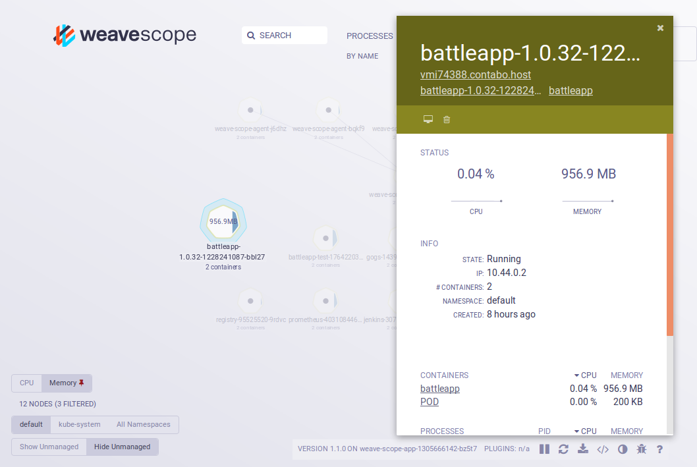

# Weave Scope
An other visualisation of the cluster is Weave Scope. To start Weave Scope we simple
have to start this script:
```
kc apply -f 'https://cloud.weave.works/launch/k8s/weavescope.yaml'
```

To access the UI we have to port forward the service on the localhost:
```
kc port-forward $(kc get pod --selector=weave-scope-component=app -o jsonpath='{.items..metadata.name}') 4040
```

Now we can access the UI on:
```
http://localhost:4040
```


