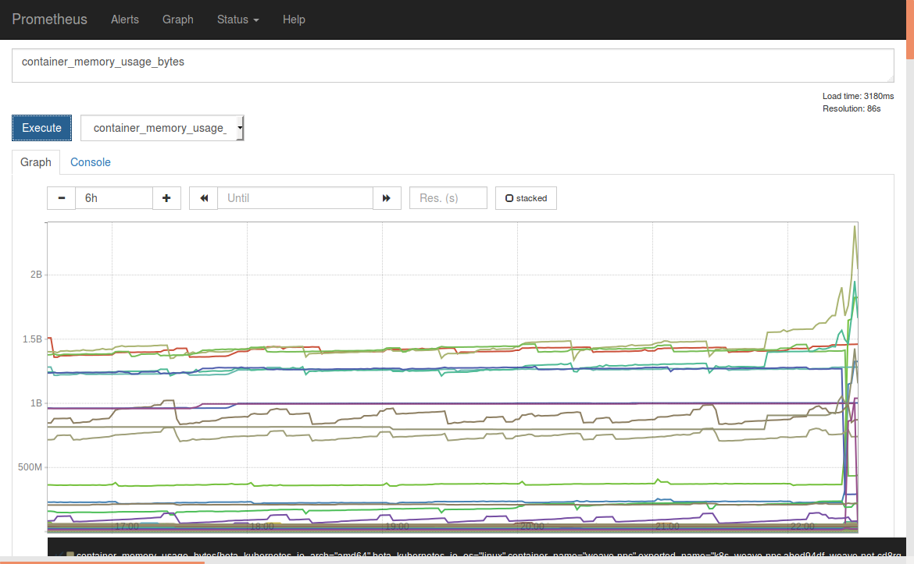

# Monitoring with Prometheus
To monitor your microservices we use Prometheus.

To start Prometheus is pretty simple:
```
kc create -f https://raw.githubusercontent.com/coreos/blog-examples/master/monitoring-kubernetes-with-prometheus/prometheus.yml
```

To see the metrics we have create a service:
```
kind: Service
apiVersion: v1
metadata:
  labels:
    app: prometheus
  name: prometheus
spec:
  ports:
  - port: 81
    targetPort: 9090
    nodePort: 30190
  selector:
    app: prometheus
  type: NodePort
```

And start it:
```
kc create -f service.yml
```

Now you can open the UI on:
```
http://disruptor.ninja:30190
```

