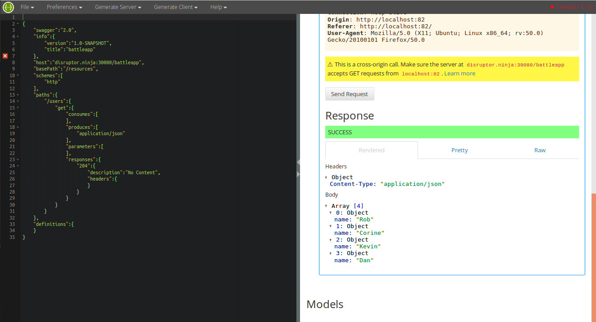

# Documentation of the `jax-rs` service

I choose [swagger](http://swagger.io/) to document my REST services. Therefore I've to 
activate CORS headers.

## Add CORS headers
To add CORS header to your REST service is pretty simple, just add the folowing dependency
that adds a response filter that intercepts every response and add the CORS headers. It
is just one class without any dependencies.

```
<dependency>
    <groupId>com.airhacks</groupId>
    <artifactId>jaxrs-cors</artifactId>
    <version>0.0.2</version>
    <scope>compile</scope>
</dependency>
```

## Create `swagger.json`
For the creation of the `swagger.json` file I use the flowing Maven plugin.
```
<plugin>
    <groupId>com.sebastian-daschner</groupId>
    <artifactId>jaxrs-analyzer-maven-plugin</artifactId>
    <version>0.12</version>
    <executions>
        <execution>
            <goals>
                <goal>analyze-jaxrs</goal>
            </goals>
            <configuration>
                <!-- Available backends are plaintext (default), swagger and asciidoc -->
                <backend>swagger</backend>
                <!-- Domain of the deployed project, defaults to example.com -->
                <deployedDomain>disruptor.ninja:30080/battleapp</deployedDomain>
            </configuration>
        </execution>
    </executions>
</plugin>
```

## Visualize `swagger.json`
To visualize the swagger documentation I'm using the swagger editor that I start locally
in a Docker container:
```
docker run -d -p 82:8080 --name swagger-editor swaggerapi/swagger-editor
```
Now I can access the swagger editor under:
```
http://localhost:82
```
And copy the content of the generated `swagger.json` into left part of the editor.

