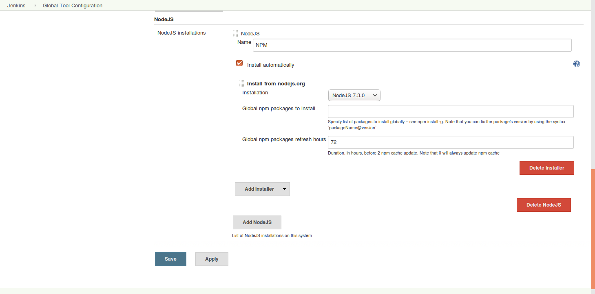

# Create an Angular 2 frontend

## Install NodeJS and NPM
We're going to use NPM as our package manager. To install NodeJS and NPM execute the
following command:

```
curl -sL https://deb.nodesource.com/setup_7.x | sudo -E bash -
sudo apt-get install -y nodejs
```

## Setup the Angular 2 project
We are using a bootstrap project to get started with Angular 2:

```
git clone --depth 1 https://github.com/angularclass/angular2-webpack-starter.git
cd angular2-webpack-starter
npm install
npm run server:dev:hmr
```

Now you can open the frontend on this url:
```
http://localhost:3000
```

## Create a Docker image
If there isn't already a `Dockerfile` in the mail folder, create one with
the following settings:

```
FROM nginx:latest

MAINTAINER Robert Brem <brem_robert@hotmail.com>

ADD dist/ /usr/share/nginx/html
```

Like the `jax-rs` service the Angular2 service needs a `build.js` script
to create and push the Docker image in the repository.

```
#!/usr/bin/jjs -fv

var version = $ENV.VERSION;
var username = $ENV.REGISTRY_USERNAME;
var password = $ENV.REGISTRY_PASSWORD;
var email = $ENV.REGISTRY_EMAIL;

var registry = "disruptor.ninja:30500";
var imageName = registry + "/robertbrem/battleapp-frontend:" + version;

var build = "docker build -t " + imageName + " .";
execute(build);

var dockerLogin = "docker login --username=" + username + " --password=" + password + " --email=" + email + " " + registry;
execute(dockerLogin);

var push = "docker push " + imageName;
execute(push);

function execute(command) {
  $EXEC(command);
  print($OUT);
  print($ERR);
}
```

## Create the Jenkins pipeline
First of all we've to install NodeJS and NPM on Jenkins.

On Jenkins go to `Manage Jenkins` `Manage Plugins`. Change to the 
`Available` tab and search for the `NodeJS Plugin` and install it.

After the restart go to `Manage Jenkins` `Global Tool Configuration`.  
Under the title `NodeJS` we make the following settings:



This installs NodeJS and NPM and we can use it in our pipeline.

The Angular2 sample project also allows us to statically analyze our code and
compares it with the official Angular2 style guide. We can include this
analysis in our pipeline with the `Checkstyle` plugin. Just search under
`Avaialble` plugins for `Checkstyle Plug-in` and install it.

```
withEnv([   "VERSION=1.0.${currentBuild.number}",
            "KUBECTL=kubectl",
            "REGISTRY_EMAIL=brem_robert@hotmail.com"]) {
            
  stage "checkout, build, test and publish"
  node {
    git url: "http://disruptor.ninja:30130/rob/battleapp-frontend"
    def npmHome = tool 'NPM'
    env.PATH = "${npmHome}/bin:${env.PATH}"
    sh "npm install"
    sh "npm run test"
    sh "npm run lint"
    sh "npm run build:prod"
    sh "./build.js"
    step([$class: 'JUnitResultArchiver', testResults: '**TESTS-*.xml'])
    step([$class: 'hudson.plugins.checkstyle.CheckStylePublisher', pattern: '**REPORTS-*.xml'])
  }
```

That the Karma tests can be executed on the server we've to change the
Karma settings from using Chrome to using PhantomJS. Therefore we've to change
the browser in `karma.conf.js`:
```
...
browsers: [
  'PhantomJS'
],
...
```

PhantomJS is not per default installed therefore we've to install it:
```
npm install --save-dev karma-phantomjs-launcher
```

That Jenkins understands the test results we've to install the 
`karma-junit-reporter`:
```
npm install karma-junit-reporter --save-dev
```

And tell Angular2 to create a report. This have to be done in the
`karma.conf.js` as well:
```
...
reporters: ['mocha', 'coverage', 'remap-coverage', 'junit'],

junitReporter: {
  outputDir: '', // results will be saved as $outputDir/$browserName.xml
  outputFile: undefined, // if included, results will be saved as $outputDir/$browserName/$outputFile
  suite: '', // suite will become the package name attribute in xml testsuite element
  useBrowserName: true, // add browser name to report and classes names
  nameFormatter: undefined, // function (browser, result) to customize the name attribute in xml testcase element
  classNameFormatter: undefined, // function (browser, result) to customize the classname attribute in xml testcase element
  properties: {} // key value pair of properties to add to the <properties> section of the report
},
...
```

That Jenkins understands the static analysis we've to adapt the `lint` 
npm script:
```
"lint": "tslint --format tslint-checkstyle-reporter -o REPORTS-tslint.xml --force \"src/**/*.ts\" && ./createCheckstyle.sh",
```

And install the `tslint-checkstyle-reporter`:
```
npm install tslint-checkstyle-reporter --save-dev
```

Additionally we've to create a script that adds the xml header and footer for
the Checkstyle plugin. This script is created in the root folder with the
name `createCheckstyle.sh`:

```
# /bin/bash

sed -i "1s/^/<?xml version='1.0' encoding='utf-8'?>\n<checkstyle version='5.7'>\n/" REPORTS-tslint.xml
echo "</checkstyle>" >> REPORTS-tslint.xml
```

