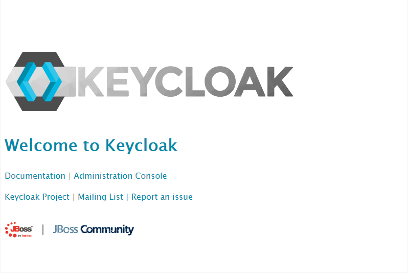

# Setup Keycloak
In a microservices environment we need to have the possibility for [SSO
(Single Sign On)](https://en.wikipedia.org/wiki/Single_sign-on). We're 
going to use [Keycloak](http://www.keycloak.org/). 

## Enable SSL on Keycloak
To use SSL we have to create a keystore that contains our 
[previously created](../03_Docker_registry)
SSL certificates. Therefore we connect to our master where the certificates are.
```
ssh root@5.189.173.45
```
On the server change in the directory with the certificates:
```
cd /etc/letsencrypt/live/disruptor.ninja/
```
Now we create a PKCS12 file based on 
[this article](https://maximilian-boehm.com/hp2121/Create-a-Java-Keystore-JKS-from-Let-s-Encrypt-Certificates.htm).
```
openssl pkcs12 -export -in fullchain.pem -inkey privkey.pem -out pkcs.p12 -name test
```
```
Enter Export Password:
```
```
test
```
```
Verifying - Enter Export Password:
```
```
test
```

In the current folder there is a new file: `pkcs.p12`.  
Copy this file on your local machine:
```
scp root@5.189.173.45:/etc/letsencrypt/live/disruptor.ninja/pkcs.p12 .
```
Now create a Java keystore based on this PKCS12 file:
```
keytool -importkeystore -deststorepass secret -destkeypass secret -destkeystore keycloak.jks -srckeystore pkcs.p12 -srcstoretype PKCS12 -srcstorepass test -alias test
```

Keycloak has persistent data therefore we have to mount this data somewhere.
The easiest way to do that is over a node selector. A more advanced solution 
would be to use GlusterFS, Flocker, NFS or something similar.

If we use node selectors for our persistence then we have to label a node.
In this case this is `5.189.153.209`.
```
kc label nodes vmi71989.contabo.host name=vmi71989
```

Now we connect to this server:
```
ssh root@5.189.153.209
```

And create an empty folder `keycloakdata`.
```
mkdir keycloakdata
```

In this folder we copy our keystore:
```
scp keycloak.jks root@5.189.153.209:/root/keycloakdata
```

Now we change the rights of the folder and its content:
```
chown -R 1000:1000 keycloakdata/
```

Now we've to tell Keycloak to use this keystore. Therefore I've created an own
Docker image:
```
FROM jboss/keycloak:2.4.0.Final

MAINTAINER Robert Brem <brem_robert@hotmail.com>

RUN sed -i 's~<security-realms>~<security-realms><security-realm name="UndertowRealm"><server-identities><ssl><keystore path="/opt/jboss/keycloak/standalone/data/keycloak.jks" keystore-password="${env.KEYSTORE_PASSWORD}" /></ssl></server-identities></security-realm>~g' /opt/jboss/keycloak/standalone/configuration/standalone.xml
RUN sed -i 's~<server name="default-server">~<server name="default-server"><https-listener name="https" socket-binding="https" security-realm="UndertowRealm"/>~g' /opt/jboss/keycloak/standalone/configuration/standalone.xml

ENTRYPOINT [ "/opt/jboss/docker-entrypoint.sh" ]
CMD ["-b", "0.0.0.0"]
```

> This Docker image is also available on Docker Hub `robertbrem\keycloak:1.0.3`

It changes the `standalone.xml` based on [this article](https://keycloak.gitbooks.io/server-installation-and-configuration/content/topics/network/https.html)
and uses an environment variable `KEYSTORE_PASSWORD` as keystore password.  

## Create a Kubernetes deployment
For our deployment we need a secret with the Keycloak user, the Keycloak
password for the user and the password for our keystore:
```
kc create secret generic keycloak --from-literal=keycloak_user=admin --from-literal=keycloak_password=admin --from-literal=keystore_password=secret
```

Our deployment looks like that:
```
apiVersion: extensions/v1beta1
kind: Deployment
metadata:
  name: keycloak
spec:
  replicas: 1
  template:
    metadata:
      labels:
        name: keycloak
    spec:
      nodeSelector:
        name: vmi71989
      containers:
      - name: keycloak
        image: robertbrem/keycloak:1.0.3
        env:
        - name: KEYCLOAK_USER
          valueFrom:
            secretKeyRef:
              name: keycloak
              key: keycloak_user
        - name: KEYCLOAK_PASSWORD
          valueFrom:
            secretKeyRef:
              name: keycloak
              key: keycloak_password
        - name: KEYSTORE_PASSWORD
          valueFrom:
            secretKeyRef:
              name: keycloak
              key: keystore_password
        volumeMounts:
          - mountPath: /opt/jboss/keycloak/standalone/data
            name: keycloakdata
        ports:
          - name: http
            containerPort: 8080
          - name: https
            containerPort: 8443
      volumes:
        - name: keycloakdata
          hostPath:
            path: /root/keycloakdata
```

Start the deployment:
```
kc create -f deployment.yml
```

## Create a Kubernetes service
To access Keycloak from outside the cluster we've to create a service:
```
apiVersion: v1
kind: Service
metadata:
  name: keycloak
  labels:
    name: keycloak
spec:
  ports:
  - name: http
    port: 8383
    targetPort: 8080
    nodePort: 30181
  - name: https
    port: 8443
    targetPort: 8443
    nodePort: 30182
  selector:
    name: keycloak
  type: NodePort
```

Start the service:
```
kc create -f service.yml
```

Test if Keycloak is up and running:
```
https://disruptor.ninja:30182
```

