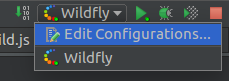
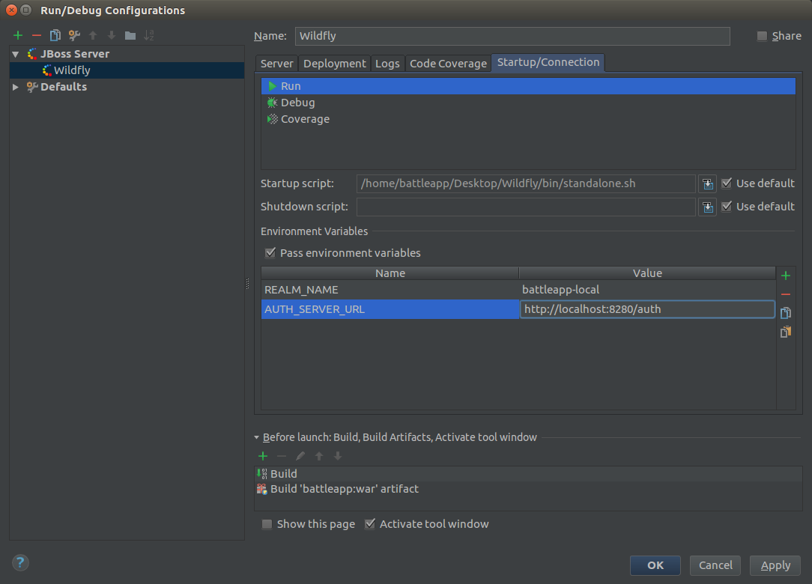

# Secure the `jax-rs` service

## Patch Wildfly with the Keycloak adapter
The first thing we've to change is the `Dockerfile` of the REST service.
Wildfly need the Keyclaok adapter that it can use Keycloak. Luckily there's
already a Docker image for that `jboss/keycloak-adapter-wildfly`. Our whole
Dockerimage looks like the flowing:

```
FROM jboss/keycloak-adapter-wildfly:2.4.0.Final

MAINTAINER Robert Brem <brem_robert@hotmail.com>

ENV DEPLOYMENT_DIR ${JBOSS_HOME}/standalone/deployments/

ADD target/battleapp.war ${DEPLOYMENT_DIR}
```

That we can test our service locally as well we've to patch our local Wildfly
as well. We've to do exactly the same as 
[the Docker image](https://hub.docker.com/r/jboss/keycloak-adapter-wildfly/~/dockerfile/) 
does.

Change into the local Wildfly directory and execute the following command:
```
KEYCLOAK_VERSION=2.4.0.Final curl -L https://downloads.jboss.org/keycloak/$KEYCLOAK_VERSION/adapters/keycloak-oidc/keycloak-wildfly-adapter-dist-$KEYCLOAK_VERSION.tar.gz | tar zx
```

Then execute the following command:
```
sed -i -e 's/<extensions>/&\n        <extension module="org.keycloak.keycloak-adapter-subsystem"\/>/' standalone/configuration/standalone.xml && \
sed -i -e 's/<profile>/&\n        <subsystem xmlns="urn:jboss:domain:keycloak:1.1"\/>/' standalone/configuration/standalone.xml && \
sed -i -e 's/<security-domains>/&\n                <security-domain name="keycloak">\n                    <authentication>\n                        <login-module code="org.keycloak.adapters.jboss.KeycloakLoginModule" flag="required"\/>\n                    <\/authentication>\n                <\/security-domain>/' standalone/configuration/standalone.xml
```

## Setup the project with Keycloak
To secure the REST service we've to create a `web.xml` file like we would do it
for normal basic authentication. The flowing `web.xml` is located in the 
`src/main/webapp/WEB-INF` folder.

```
<web-app xmlns="http://java.sun.com/xml/ns/javaee"
         xmlns:xsi="http://www.w3.org/2001/XMLSchema-instance"
         xsi:schemaLocation="http://java.sun.com/xml/ns/javaee http://java.sun.com/xml/ns/javaee/web-app_3_0.xsd"
         version="3.0">

    <security-constraint>
        <web-resource-collection>
            <web-resource-name>health</web-resource-name>
            <url-pattern>/resources/health</url-pattern>
        </web-resource-collection>
        <!-- OMIT auth-constraint -->
    </security-constraint>

    <security-constraint>
        <web-resource-collection>
            <web-resource-name>cors</web-resource-name>
            <url-pattern>/*</url-pattern>
            <http-method>GET</http-method>
            <http-method>POST</http-method>
            <http-method>PUT</http-method>
            <http-method>DELETE</http-method>
        </web-resource-collection>
        <auth-constraint>
            <role-name>user</role-name>
        </auth-constraint>
    </security-constraint>

    <login-config>
        <auth-method>KEYCLOAK</auth-method>
        <realm-name>this is ignored currently</realm-name>
    </login-config>

    <security-role>
        <role-name>admin</role-name>
    </security-role>
    <security-role>
        <role-name>user</role-name>
    </security-role>
</web-app>
```

Here we can see the roles `admin` and `user` we've previously created in the
Keycloak console. Additionally there's a `health` endpoint that's not secured.
This is the endpoint on which Kubernetes checks if the application is deployed
and therefore ready. We're going to create this endpoint later.

Now we've to define where our Keycloak server is running and which realm we
want to use. This can be done in a `keycloak.json` that's located in the same
folder `src/main/webapp/WEB-INF`.

```
{
  "realm": "${env.REALM_NAME}",
  "bearer-only": true,
  "auth-server-url": "${env.AUTH_SERVER_URL}",
  "ssl-required": "none",
  "resource": "battleapp",
  "enable-cors": true
}
```

Like you can see we tell Keycloak to handle CORS. Keycloak needs to add additional 
headers anyway and therefore it makes sense to let Keycloak add the CORS
headers as well.  
This results in the deletion of the existing CORS dependency:

```
<dependency>
    <groupId>com.airhacks</groupId>
    <artifactId>jaxrs-cors</artifactId>
    <version>0.0.2</version>
    <scope>compile</scope>
</dependency>
```

That we can use the same `war` on different stages we have to set the realm
name and the server url over environment variables. For the local setup we've
to open the Wildfly configuration:



Change in the `Startup/Connection` tab and add the two environment variables.



## Create the health check
That Kubernetes recognized if the application is up and running we've to 
create the health check we've already defined in the `web.xml`.

```
@Path("health")
public class HealthResource {

    @Dedicated
    @Inject
    ExecutorService healthPool;

    @GET
    public void getHealth(@Suspended AsyncResponse response) {
        CompletableFuture
                .supplyAsync(this::getHealthText, healthPool)
                .thenAccept(response::resume);
    }

    public String getHealthText() {
        return "everything ok!";
    }
}
```

Now we can start the local Wildfly with the secured application.

## Secure test environment
To let the application run in our test stage we've to make some adaptions
to the `start.js` file from the start test environment project.
First of all we've to change the test url from 
`http://disruptor.ninja:31080/battleapp/resources/users` to
`http://disruptor.ninja:31080/battleapp/resources/health`.  
Then we've to add the two environment variables for Keycloak:

```
...
var realmName = "battleapp-test";
var authServerUrl = "https://disruptor.ninja:30182/auth";
...
dfw.write("        env:\n");
dfw.write("        - name: REALM_NAME\n");
dfw.write("          value: \"" + realmName + "\"\n");
dfw.write("        - name: AUTH_SERVER_URL\n");
dfw.write("          value: \"" + authServerUrl + "\"\n");
...
```

Now the deployment on the test stage is secured.

## Secure prod environment
To let the application run in our prod stage we've to make some adaptions
to the `start.js` file from the canary environment project.
First of all we've to change the test url from 
`http://disruptor.ninja:30080/battleapp/resources/users` to
`http://disruptor.ninja:30080/battleapp/resources/health`.  
Then we've to add the two environment variables for Keycloak:

```
...
var realmName = "battleapp";
var authServerUrl = "https://disruptor.ninja:30182/auth";
...
dfw.write("        env:\n");
dfw.write("        - name: REALM_NAME\n");
dfw.write("          value: \"" + realmName + "\"\n");
dfw.write("        - name: AUTH_SERVER_URL\n");
dfw.write("          value: \"" + authServerUrl + "\"\n");
...
```

## System test of the secured service
Our system test tries to test the secured `users` url. Therefore we've to
tell the test how to access the secured endpoint.
To access the service we need to add the `keycloak-wildfly-adapter`:

```
<dependency>
    <groupId>org.keycloak</groupId>
    <artifactId>keycloak-wildfly-adapter</artifactId>
    <version>2.4.0.Final</version>
    <scope>test</scope>
</dependency>
```

Now we can create a class that requests a token form the Keycloak server:
```
public class KeycloakHeaderCreater {

    public static final String CLIENT_ID = "battleapp-frontend";
    public static final String REALM = System.getenv("REALM_NAME");
    public static final String KEYCLOAK_URL = System.getenv("KEYCLOAK_URL");

    public static AccessTokenResponse getTokenResponse(String user, String password) throws IOException {
        HttpClient client = new HttpClientBuilder().disableTrustManager().build();
        try {
            HttpPost post = new HttpPost(KeycloakUriBuilder.fromUri(KEYCLOAK_URL)
                    .path(ServiceUrlConstants.TOKEN_PATH).build(REALM));
            List<NameValuePair> formparams = new ArrayList<>();
            formparams.add(new BasicNameValuePair(OAuth2Constants.GRANT_TYPE, "password"));
            formparams.add(new BasicNameValuePair("username", user));
            formparams.add(new BasicNameValuePair("password", password));

            formparams.add(new BasicNameValuePair(OAuth2Constants.CLIENT_ID, CLIENT_ID));

            UrlEncodedFormEntity form = new UrlEncodedFormEntity(formparams, "UTF-8");
            post.setEntity(form);
            HttpResponse response = client.execute(post);
            int status = response.getStatusLine().getStatusCode();
            HttpEntity entity = response.getEntity();
            if (status != 200) {
                throw new IOException("Bad status: " + status);
            }
            if (entity == null) {
                throw new IOException("No Entity");
            }
            InputStream is = entity.getContent();
            try {
                AccessTokenResponse tokenResponse = JsonSerialization.readValue(is, AccessTokenResponse.class);
                return tokenResponse;
            } finally {
                try {
                    is.close();
                } catch (IOException ignored) {
                }
            }
        } finally {
            client.getConnectionManager().shutdown();
        }
    }

}
```

We need a token when we request the users from the service:

```
@Test
    public void shouldReturn200() throws IOException {
        String token = KeycloakHeaderCreater
                .getTokenResponse(
                        System.getenv("APPLICATION_USER_NAME"),
                        System.getenv("APPLICATION_PASSWORD"))
                .getToken();
        Response response = provider
                .target()
                .request()
                .header("Authorization", "Bearer " + token)
                .get();
        assertThat(response.getStatus(), is(200));
    }
```

You can run the test locally with the following command:
```
HOST=localhost PORT=8080 APPLICATION_USER_NAME=rob APPLICATION_PASSWORD=1234 REALM_NAME=battleapp-local KEYCLOAK_URL=http://localhost:8280/auth mvn clean install failsafe:integration-test failsafe:verify
```

Finally we've to add the environment variables in the pipeline project:
```
withEnv([   "VERSION=1.0.${currentBuild.number}",
            "REGISTRY_EMAIL=brem_robert@hotmail.com",
            "KUBECTL=kubectl",
            "HOST=disruptor.ninja",
            "KEYCLOAK_URL=https://disruptor.ninja:30182/auth"]) {
  
  ...

  stage "system test"
  node {
    git url: "http://disruptor.ninja:30130/rob/battleapp-st"
    def mvnHome = tool 'M3'
    sh "PORT=31080 REALM_NAME=battleapp-test ${mvnHome}/bin/mvn clean install failsafe:integration-test failsafe:verify"
    step([$class: 'JUnitResultArchiver', testResults: '**/target/failsafe-reports/TEST-*.xml'])
  }

  ...

```

## UI test of the secured service
Our ui test tries to test the secured `users` url. Therefore we've to
change the url to the `health` url.

```
@Location("http://disruptor.ninja:31080/battleapp/resources/health")
public class BattleAppPage {
}
```

And the expected text:
```
@RunAsClient
@RunWith(Arquillian.class)
public class BattleAppIT {

    @Drone
    WebDriver browser;

    @Test
    public void shouldContainRobert(@InitialPage BattleAppPage page) {
        String expectedToContain = "everything ok!";
        String content = browser.getPageSource();
        assertThat(content, containsString(expectedToContain));
    }

}
```

The test can locally be executed with the same run configuration like before.

## Last test of the secured service
Our last test tries to test the secured `users` url. Therefore we've to
change the url to the `health` url inside the Jenkins pipeline:

```
  stage "last test"
  node {
    git url: "https://github.com/robertBrem/BattleApp-LT"
    def mvnHome = tool 'M3'
    sh "${mvnHome}/bin/mvn clean verify -Dperformancetest.webservice.host=disruptor.ninja -Dperformancetest.webservice.port=31080 -Dperformancetest.webservice.threads=5 -Dperformancetest.webservice.iterations=500 -Dperformancetest.webservice.url=/battleapp/resources/health"
    archiveArtifacts artifacts: 'target/reports/*.*', fingerprint: true
  }
```

The test can locally be executed with the following command:

```
mvn clean verify -Dperformancetest.webservice.host=localhost -Dperformancetest.webservice.port=8080 -Dperformancetest.webservice.threads=2 -Dperformancetest.webservice.iterations=50 -Dperformancetest.webservice.url=/battleapp/resources/health
```

## Consumer driven contract test of the secured service
The consumer driven contract test has to be adapted exaclty the same way as
the system test from before.

```
public class BattleAppIT {

    @Rule
    public JAXRSClientProvider provider = buildWithURI("http://" + System.getenv("HOST") + ":" + System.getenv("PORT") + "/battleapp/resources/users");

    @Test
    public void shouldReturnDan() throws IOException {
        String expectedToContain = "Dan";
        String token = KeycloakTokenCreator
                .getTokenResponse(
                        System.getenv("APPLICATION_USER_NAME"),
                        System.getenv("APPLICATION_PASSWORD"))
                .getToken();
        String response = provider
                .target()
                .request()
                .header("Authorization", "Bearer " + token)
                .get(String.class);
        assertThat(response, containsString(expectedToContain));
    }

}
```

The test can be locally executed with the following command:
```
HOST=localhost PORT=8080 APPLICATION_USER_NAME=rob APPLICATION_PASSWORD=1234 REALM_NAME=battleapp-local KEYCLOAK_URL=http://localhost:8280/auth mvn clean install failsafe:integration-test failsafe:verify
```

The pipeline step has to be extended with the `REALM_NAME` as well as the
system test was before.

```
stage "consumer driven contract test"
node {
  git url: "http://disruptor.ninja:30130/rob/battleapp-cdct"
  def mvnHome = tool 'M3'
  sh "PORT=31080 REALM_NAME=battleapp-test ${mvnHome}/bin/mvn clean install failsafe:integration-test failsafe:verify"
  step([$class: 'JUnitResultArchiver', testResults: '**/target/failsafe-reports/TEST-*.xml'])
}
```
