# Initial setup of Keycloak
That we can use Keyclaok for our `jax-rs` service and our Angular2 frontend
we have to create some roles and a user.

## Start a local Keycloak server
That we can test our application on the local machine we've to start a 
Keycloak server locally.

For our local Keycloak server we don't need SSL therefore we can use the
officially image directly. But first we need to create a local folder
where Keycloak can store its persistent data:

```
mkdir -p ~/Desktop/dockervolumes/keycloakdata
```

Set the rights of the folder to `1000:1000`:
```
chown -R 1000:1000 ~/Desktop/dockervolumes/keycloakdata
```

And now we can start our local Keycloak server.
```
docker run -d -e KEYCLOAK_USER=admin -e KEYCLOAK_PASSWORD=admin -p 8280:8080 -v ~/Desktop/dockervolumes/keycloakdata/:/opt/jboss/keycloak/standalone/data --name keycloak jboss/keycloak:2.4.0.Final
```

## Create Keycloak roles and users
Open the Keycloak console on `http://localhost:8280/auth/admin`.

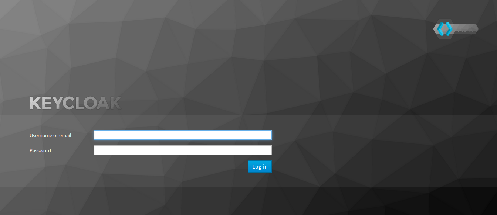

Login in with the user `admin` and the password `admin`. We've defined this
password on the startup of the Docker container.

Keycloak displays the Master realm. That's the realm for Keycloak itself.
For our application we need an own realm therefore we've to create one.
Click on `Master` and a button `Add realm` appears.


We choose the name `battleapp-local` for our local Keycloak.
> We also have to create two realms on our Keycloak that we've started in
> Kubernetes. One for the test stage and one for the production stage.
> I called them `battleapp-test` and `battleapp`.

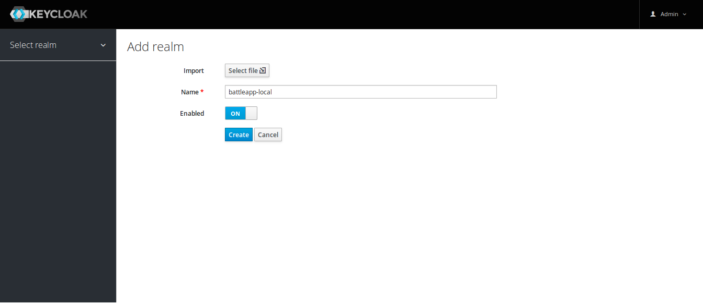

Click `Create`.

First we're going to create two roles `user` and `admin`. Change to the 
`Roles` tab and create these two roles.

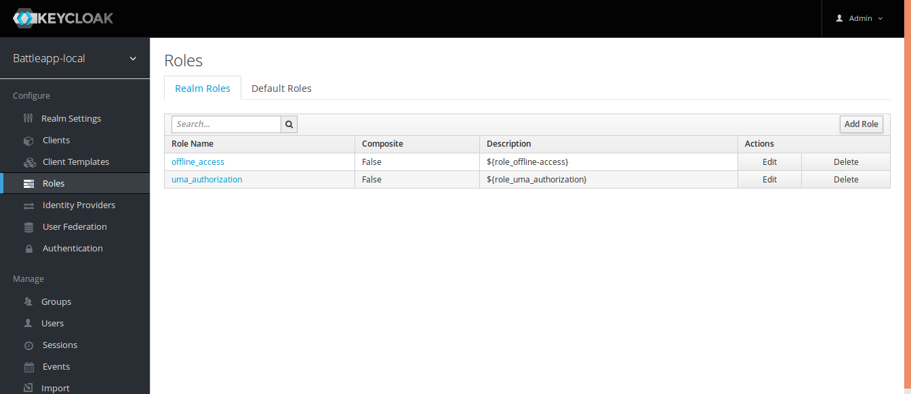

Click on the button `Add Role`.

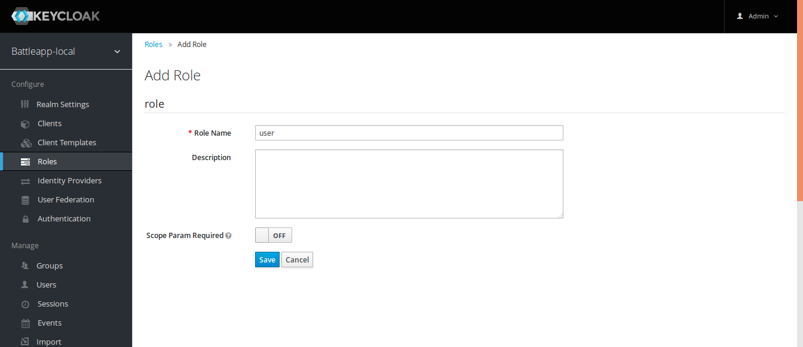

Click `Save` and do the same for `admin`.

When we've the roles we can create a user and add these roles to the user.
Change to the `Users` tab and create a user.

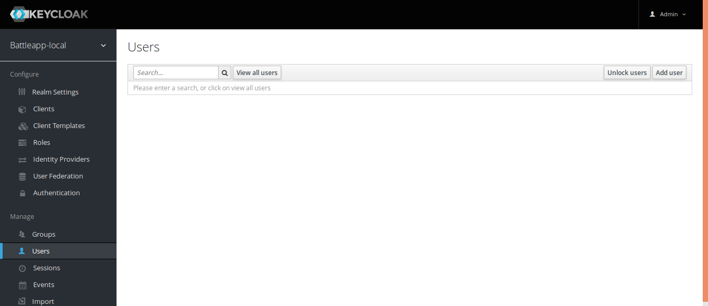

Click on the button `Add user`.

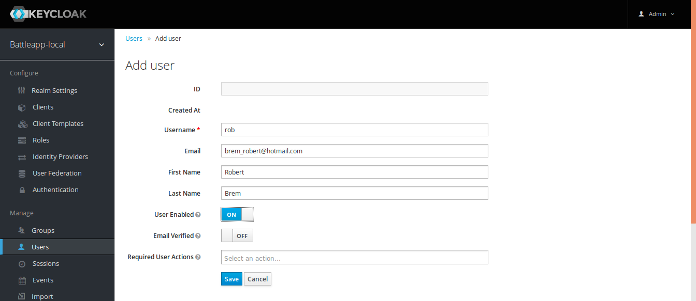

Click `Save`.

That the user can login he need a password. Therefore we've to change 
to the `Credentials` tab and enter a password.

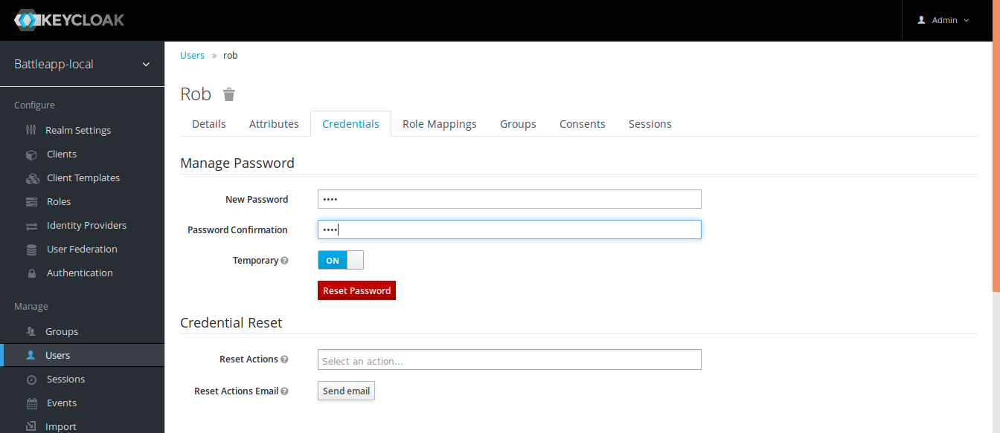

Click `Reset Password` -> `Change Password`.

The last setting we've to make is to assign the created roles to our user.
Change to the `Role Mappings` tab and assign the `user` and `admin` role
from `Available Roles` to `Assigned Roles`.

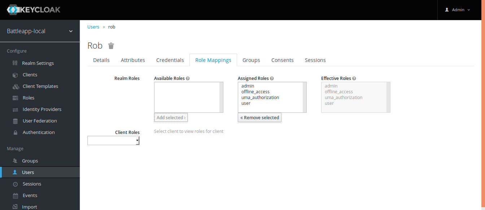

## Add the REST service and the frontend
Keycloak need to know where our applications are running. We can setup our
two microservices in the `Client` tab.

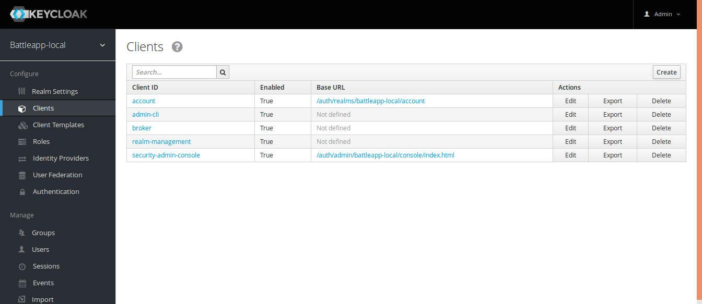

Click on the button `Create`.  
The REST service is the first service we're going to create.

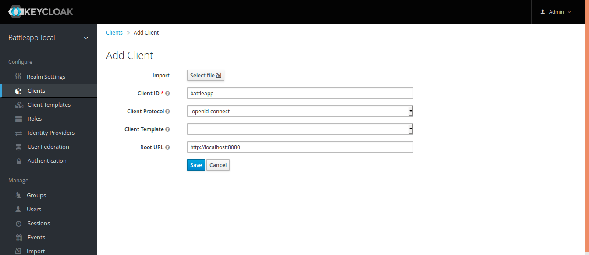

Click `Save`.

Change the `Access Type` to `bearer-only` and click `Save`.

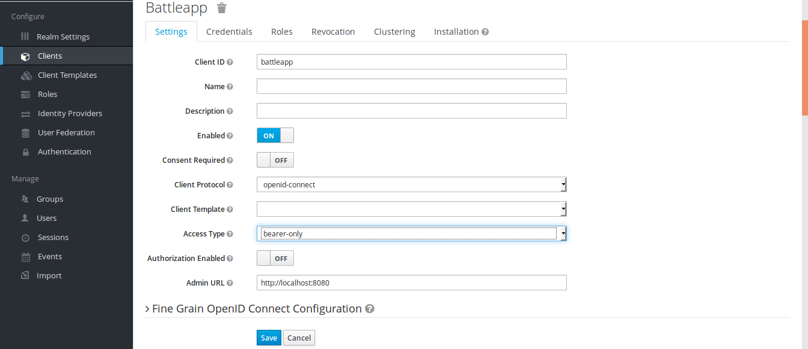

That was all for the REST service now we can create the frontend service.


Click `Save`.

The frontend service is of the already chosen `Access Type` `public`.