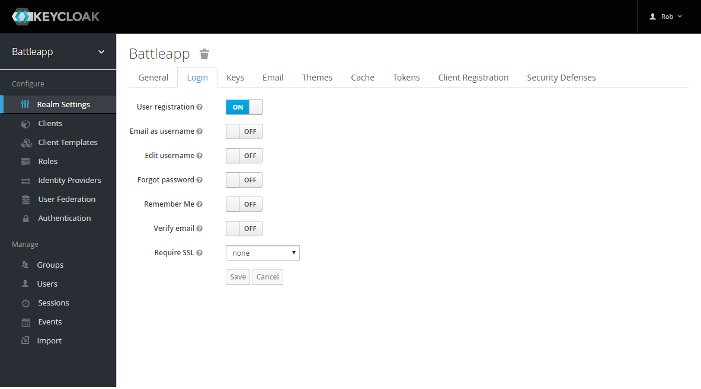
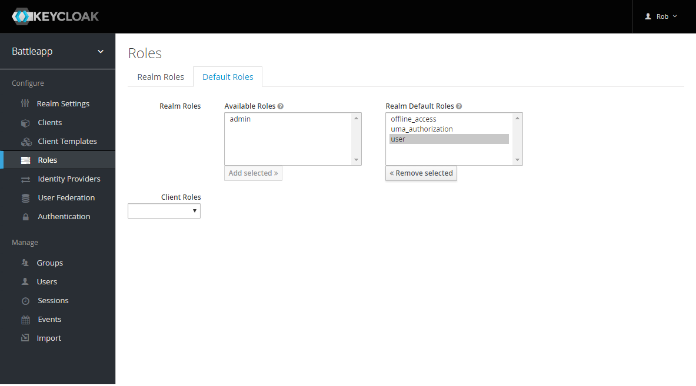
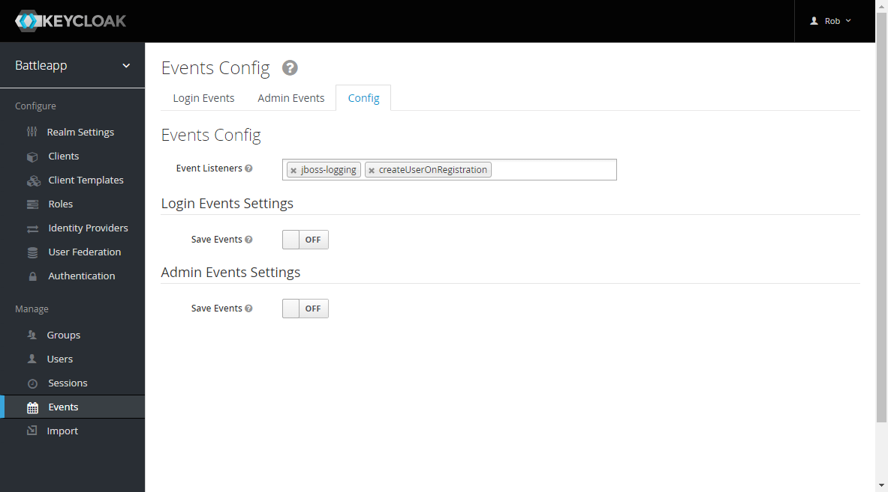

# Setup Keycloak with an event provider

If a user register itself on the application a user in the Keycloak
database is created. We've a user in our application too. To
connect these two users we've to do the following steps.

## Install an event provider in Keycloak
The first thing we've to do is to create an install an event
provider inside Keycloak. This event provider listens on
register events. When somebody register itself on the side
this provider gets the event and can act depending on the typ of
the event. If created a provider for that
[here](https://github.com/robertBrem/KeycloakEventProvider).

The provider takes the following arguments as environment 
variables:

```
public static final String CLIENT_ID = System.getenv("KEYCLOAK_CLIENT");
public static final String REALM = System.getenv("REALM_NAME");
public static final String KEYCLOAK_URL = System.getenv("KEYCLOAK_URL");
public static final String APPLICATION_USER_NAME = System.getenv("APPLICATION_USER_NAME");
public static final String APPLICATION_PASSWORD = System.getenv("APPLICATION_PASSWORD");
public static final String APPLICATION_URL = System.getenv("APPLICATION_URL");
```

To create this provider we've to clone and build the project:

```
git clone https://github.com/robertBrem/KeycloakEventProvider
```

```
mvn clean package
```

The package command creates two `jar` files:
`event.listener-jar-with-dependencies.jar` and 
`event.listener.jar`. We're going to use the 
`event.listener-jar-with-dependencies.jar` file. This `jar`
contains all the needed dependencies.

Now we've to install this provider inside our Keycloak
server. Therefore we've to update our Keycloak Docker image:

```
FROM jboss/keycloak:2.4.0.Final

MAINTAINER Robert Brem <brem_robert@hotmail.com>

RUN sed -i 's~<security-realms>~<security-realms><security-realm name="UndertowRealm"><server-identities><ssl><keystore path="/opt/jboss/keycloak/standalone/data/keycloak.jks" keystore-password="${env.KEYSTORE_PASSWORD}" /></ssl></server-identities></security-realm>~g' /opt/jboss/keycloak/standalone/configuration/standalone.xml
RUN sed -i 's~<server name="default-server">~<server name="default-server"><https-listener name="https" socket-binding="https" security-realm="UndertowRealm"/>~g' /opt/jboss/keycloak/standalone/configuration/standalone.xml

ADD event.listener-jar-with-dependencies.jar /opt/jboss/keycloak/providers/

ENTRYPOINT [ "/opt/jboss/docker-entrypoint.sh" ]
CMD ["-b", "0.0.0.0"]
```

It's important to copy the `jar` file in the same folder as the
`Dockerfile`.  
I've already built this image and pushed it to my Dockerhub.
It's in the version `1.0.17`. Now we've to update our 
Keycloak Kubernetes deployment. We also have create two Keycloak
server one in our `test` namespace an the other one in our 
production environment.  
The deployment for the Keycloak in our test environment looks
like that:

```
apiVersion: extensions/v1beta1
kind: Deployment
metadata:
  name: keycloak
  namespace: test
spec:
  replicas: 1
  template:
    metadata:
      labels:
        name: keycloak
    spec:
      nodeSelector:
        name: vmi74389
      containers:
      - name: keycloak
        image: robertbrem/keycloak:1.0.17
        env:
        - name: REALM_NAME
          value: "battleapp"
        - name: KEYCLOAK_URL
          value: "https://disruptor.ninja:31182/auth/"
        - name: KEYCLOAK_CLIENT
          value: "battleapp-frontend"
        - name: APPLICATION_URL
          value: "http://disruptor.ninja:31080/battleapp/resources/users"
        - name: APPLICATION_USER_NAME
          valueFrom:
            secretKeyRef:
              name: application
              key: application_user_name
        - name: APPLICATION_PASSWORD
          valueFrom:
            secretKeyRef:
              name: application
              key: application_password
        - name: KEYSTORE_PASSWORD
          valueFrom:
            secretKeyRef:
              name: keycloak
              key: keystore_password
        volumeMounts:
          - mountPath: /opt/jboss/keycloak/standalone/data
            name: keycloakdata
        ports:
          - name: http
            containerPort: 8080
          - name: https
            containerPort: 8443
      volumes:
        - name: keycloakdata
          hostPath:
            path: /root/keycloakdata
```

I'm going to set the `REALM_NAME`, `KEYCLOAK_URL`, 
`KEYCLOAK_CLIENT` and `APPLICATION_URL` environment directly,
all pointing to the corresponding test environment 
endpoints.
We can delete `KEYCLOAK_USER` and `KEYCLOAK_USER` after 
we've started the Keycloak server the first time. This is not
needed until we mount the Keycloak data on the host.

That we can use the `application` secret for the
`APPLICATION_USER_NAME` and the `APPLICATION_PASSWORD` we've
to create this secret in the test environment:

```
kctest create secret generic application --from-literal=application_user_name=rob --from-literal=application_password=1234
```

And the `keycloak` secret for the keystore password as well:

```
kctest create secret generic keycloak --from-literal=keycloak_user=rob --from-literal=keycloak_password=1234 --from-literal=keystore_password=1234
```

Now we can create this deployment in the test environment:

```
kc create -f deployment.yml
```

At next we've to create a new service for the Keycloak
in the test environment:

```
apiVersion: v1
kind: Service
metadata:
  name: keycloak
  namespace: test
  labels:
    name: keycloak
spec:
  ports:
  - name: http
    port: 8883
    targetPort: 8080
    nodePort: 31181
  - name: https
    port: 8843
    targetPort: 8443
    nodePort: 31182
  selector:
    name: keycloak
  type: NodePort
```

And create it:

```
kc create -f service.yml
```

>> Now we've to do the same for the production environment.

## Changes in the Keycloak console
To activate the user registration and our event provider we've
to make some changes in the Keycloak console. Login to 
`https://disruptor.ninja:31182/auth/` `Administration Console`

Select `Realm Settings` in the navigation and change to the
`Login` tab. Activate the `User registration`.



At next change to `Roles` in the navigation and to the
`Default Roles` tab. Now add `user` to the default roles.



Finally change to `Events` in the navigation and to the
`Config` tab. Add `createUserOnRegistration` in the
`Event Listeners` field.



>> Now we've to do the same for the production environment.